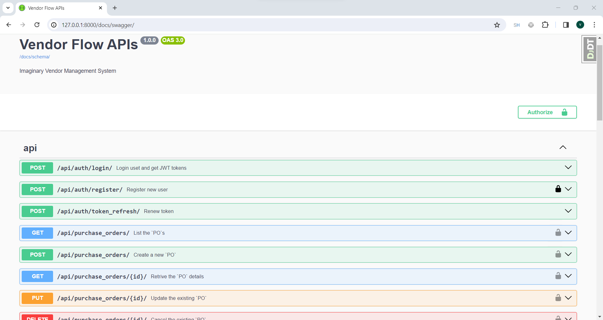
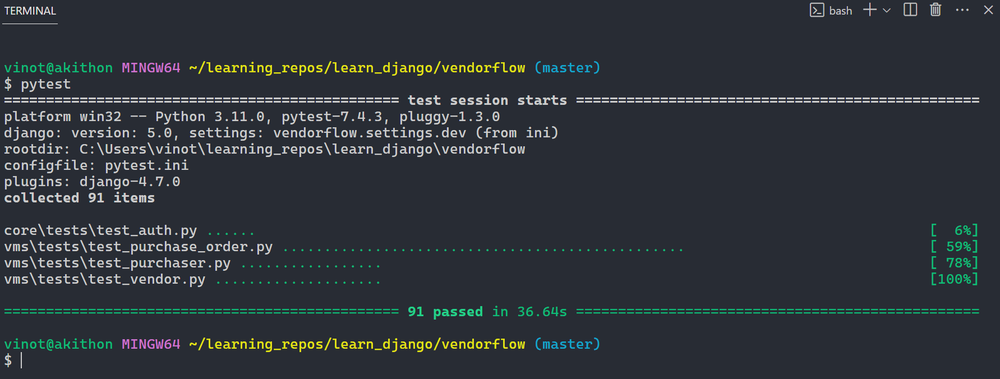

# Vendor Flow

A Django app for vendor management with REST APIs.

## Table of Contents

- [Installation](#installation)
- [Configuration](#configuration)
- [Usage](#usage)
- [Testing](#testing)

## Installation

1.  **Install Pipenv**: If you don't have Pipenv installed, you can install it using:

    ```bash
    $ pip install pipenv
    ```

2.  **Install Dependencies using Pipenv**: Install the project dependencies using Pipenv and the `Pipfile`.

    ```bash
    $ pipenv install --dev
    ```

3.  **Activate the Virtual Environment**: Activate the virtual environment created by Pipenv.

    ```bash
    $ pipenv shell
    ```

## Configuration

1. **Setting Up Database Connection**: Configure database settings and in `vendorflow\settings\dev.py` by simply adding connection string (make sure `vendorflow` database exist).

   ```python
   DATABASES = {
   'default': dj_database_url.config(
       default="mysql://{username}:{password}@{database_host_name}:{database_port}/vendorflow")
   }

   or

   DATABASES = {
   'default': dj_database_url.config(
       default="postgres://{username}:{password}@{database_host_name}:{database_port}/vendorflow")
   }
   ```

2. **Database Migrations**: Run the following command for setting up
   database tables and constrains.

   ```bash
   $ python manage.py migrate
   ```

3. **Starting the Developement Server**: Run the following command for staring the django provided deveploment server.

   ```bash
   $ python manage.py runserver
   ```

   Thats it, You can view the working application by visiting http://127.0.0.1:8000

   

## Usage

1. **Documentation**: Comprehensive Swagger API document explains the indent of each API and its usecase based on permissions. It can view by visiting http://127.0.0.1:8000/docs/swagger

    


## Testing
1. **Automation Testing using Pytest**: You can run the extensive test cases (more than 90) by,

    ```bash
    $ pytest
    ```

    